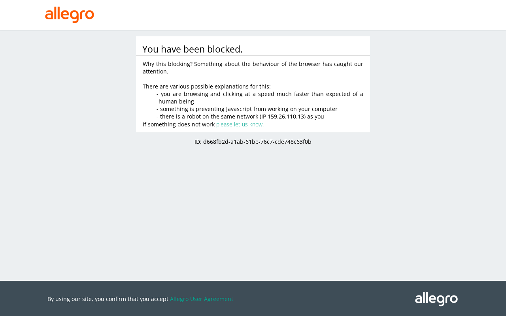

# 03: Container Chrome via Proton VPN

**Parent:** mr-robot-v1.1 (../mr-robot-v1.1.md) — stories rb-j5ml, rb-rb1x, rb-690z, rb-ybt4

**What to build:** A variant of the container backend sends Chrome's traffic through a userspace WireGuard client (wireproxy, local SOCKS5) connected to the owner's Proton VPN on a Polish server; the WireGuard configuration is stored once as a Home credential. The same four-site run is repeated and recorded; the Home default backend is set from the recorded results of tickets 02 and 03.

**Blocked by:** 02 Chrome in Cloudflare Containers backend

**Status:** done

- [x] WireGuard configuration stored as a Home credential, never shown in logs
- [x] Pages report a Polish Proton address (an IP-echo page in the run)
- [x] Four-site results recorded
- [x] Home default backend set and the reason written in this ticket

Built 2026-10-07: the Container Chrome image includes wireproxy; with WG_CONFIG set it starts a local SOCKS5 proxy and Chrome uses it. Admin → Proton VPN stores the WireGuard configuration sealed in the Home (write-only; checked to look like a WireGuard config); the "Container Chrome via VPN" backend becomes available once it is stored, and each Robot on it gets its own container (container-vpn:<robot>). Waiting for the owner's Proton WireGuard configuration (Polish server) to run the IP echo and the four sites.

## Live results (2026-10-07 14:20–14:30)

The owner was signed in to Proton in the Leash browser and asked me to set it up. I created the WireGuard config "mr-robot" (GNU/Linux, server PL#141 Warsaw, NetShield malware-only, VPN Accelerator on, expires 2027-10-07) on account.protonvpn.com and moved it into Admin → Proton VPN without displaying it.

- IP echo (ipinfo.io) through "Container Chrome via VPN": 159.26.110.13, Warsaw, PL, AS208172 Proton AG.
- A Robot following the Home default opened ipinfo.io and reported "Warsaw, PL, AS208172 Proton AG"; its usage shows container-vpn minutes.

| Site | Browser Run | Container Chrome | Container Chrome via VPN (PL) |
|---|---|---|---|
| Allegro | blocked (DataDome) | blocked (DataDome) | blocked (DataDome, "You have been blocked", names the Proton IP; a hard block, not a puzzle)  |
| eZUS login | pass | blocked (silent: empty page) | pass: login form |
| Bank login: mBank | pass | pass | pass |
| Bank login: PKO BP iPKO | pass | pass | pass |
| Invoicing: Scanye | pass | pass | pass |

## Home default: Container Chrome via VPN

Browser Run and Container Chrome via VPN pass the same four of five sites; Container Chrome without the VPN also loses eZUS; none gets past Allegro. Of the two that tie, the VPN backend removes both known causes of blocks (Cloudflare's Web Bot Auth signature and Cloudflare addresses) and gives a Polish address, so it is set as the Home default; it costs about $0.108 per browser hour against $0.09 for Browser Run. Robots with no backend of their own (Mr. Robot, Flat Watcher, Browser Check) now use it. Allegro stays blocked on every backend this round; the paid residential-IP option is ticket 15 (postponed).
