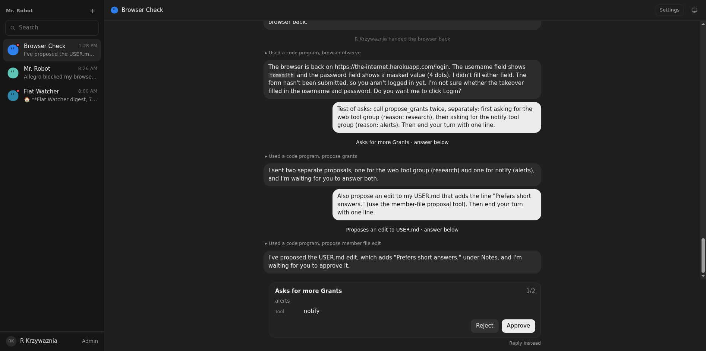
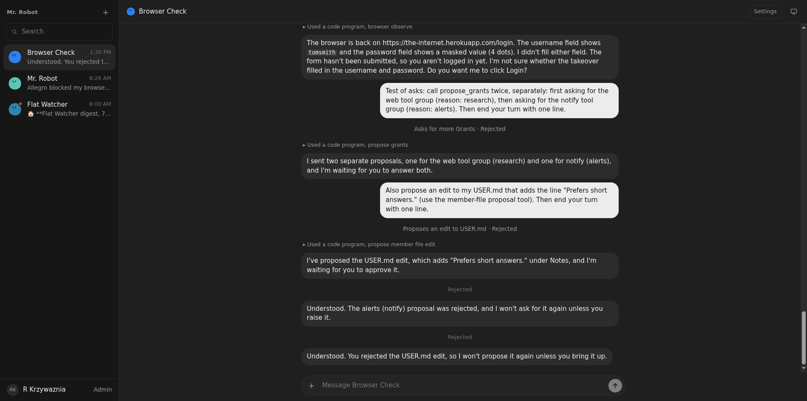

# 06: Asks in place of the composer

**Parent:** mr-robot-v1.1 (../mr-robot-v1.1.md) — stories rb-dat4, rb-r0oj, rb-f5um, rb-qo0r, rb-14cp

**What to build:** Every pending ask (grant proposal, question, setup approval, member-file edit) replaces the composer, oldest first, with a count when there are several and a 'reply instead' way to type; answering brings the composer back, and the stream keeps a one-line record of the ask and answer. The composer's add button is vertically centred and the robot's thinking uses the full message width.

**Blocked by:** None (can start immediately)

**Status:** done

- [x] A grant proposal appears in the composer area, not in the stream
- [x] Two pending asks show 1/2 then 2/2
- [x] Answering restores the composer; the stream shows the one-line record
- [x] Add button centred; thinking at full width (screenshot in ticket)

Verified live 2026-10-07 on Browser Check: a grant proposal and a USER.md edit proposal were pending at once; the composer was replaced by the first with "1/2", after rejecting it the second showed "2/2", after rejecting that the composer came back. The stream keeps one line per ask ("Asks for more Grants · Rejected", "Proposes an edit to USER.md · Rejected"); "Reply instead" opens the composer without answering. Component tests in chat-view.test.tsx.

- Two asks: 
- After answering, with the composer back (add button centred, the Robot's replies at the full message width): 

"The robot's thinking" is read as the Robot's reply bubbles: the chat shows no separate reasoning, and replies were capped at 560 px; they now use the full message column (760 px, the composer's width). A second grant proposal still replaces an open one, as before.
