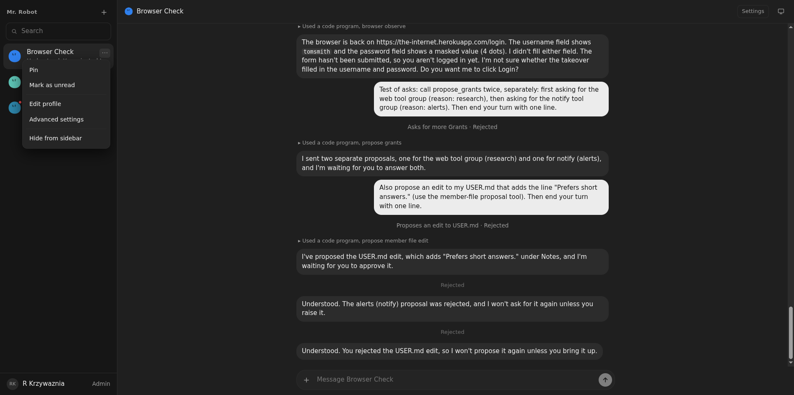
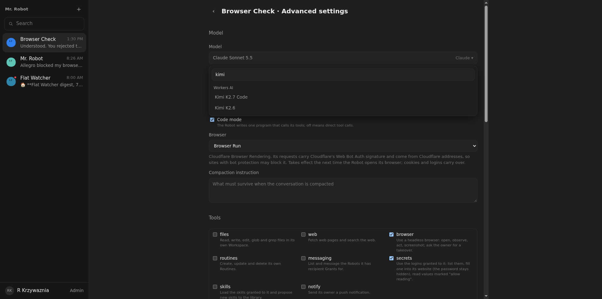

# 07: Settings navigation, model search, list heights

**Parent:** mr-robot-v1.1 (../mr-robot-v1.1.md) — stories rb-zrac, rb-kzmf, rb-woko, rb-gi08

**What to build:** The robot list menu gains Advanced settings. The model control becomes a searchable combobox grouped by provider. Tools and skills lists in advanced settings get a maximum height with their own scroll. The prompt preview no longer repeats the tools list.

**Blocked by:** None (can start immediately)

**Status:** done

- [x] Menu opens Advanced settings
- [x] Typing 'kimi' filters the model list to matching models across providers
- [x] Long tool and skill lists scroll inside their box
- [x] Prompt preview shows no tools list

Verified live 2026-10-07: the robot list menu has Advanced settings next to Edit profile and opens the page (); the model control is a searchable list grouped by provider, and typing "kimi" left only the Kimi models (only Workers AI offers them in this Home; there is no OpenCode Go key) (); the Tools list sits in a bordered box with a 280 px maximum height and its own scroll (same for Skills); the prompt preview lists sections and skills, no tools. Component test model-select.test.tsx checks the filter across providers (Workers AI and OpenCode Go) and the pick.
