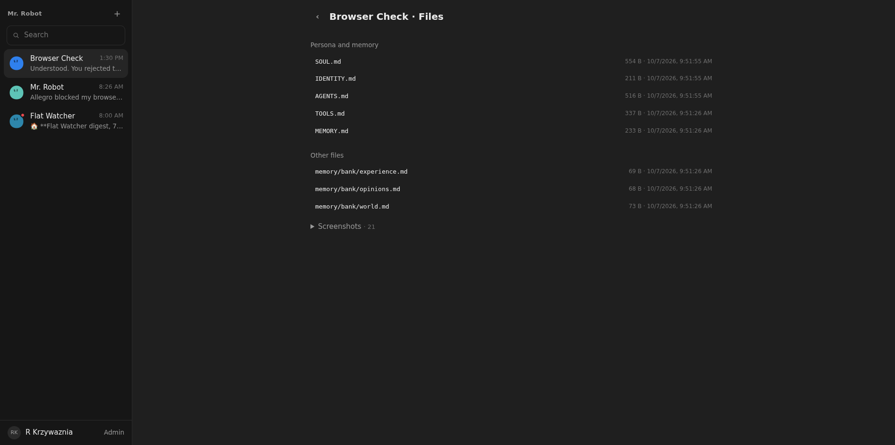
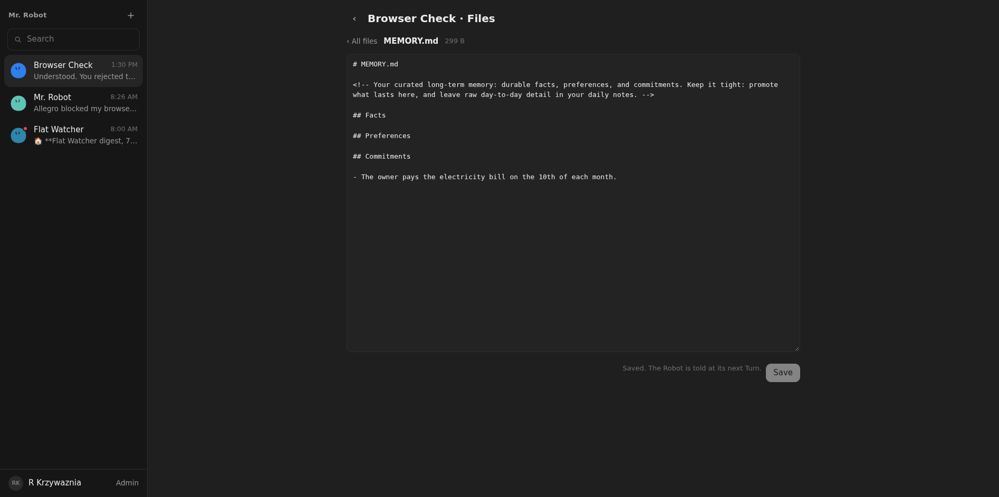

# 08: Files view for workspace and memory

**Parent:** mr-robot-v1.1 (../mr-robot-v1.1.md) — stories rb-1miy, rb-q5eb, rb-xwks

**What to build:** Each robot has a Files view, from the panel and the robot menu, listing its workspace with Persona files and MEMORY.md pinned, daily notes, local skills and other files; any file opens in an editor and saves. The robot receives a note at its next turn that the owner edited a file.

**Blocked by:** None (can start immediately)

**Status:** done

- [x] Files view lists the seeded files of a new robot
- [x] Editing MEMORY.md saves to R2 and the robot's next turn mentions the change
- [x] Large and binary files open read-only with a size note

Verified live 2026-10-07 on Browser Check: the robot menu and the panel open "Files"; persona files and MEMORY.md are pinned, then daily notes, skills, other files, and screenshots folded (). Editing MEMORY.md and saving wrote it to R2 (); the chat shows "R Krzywaznia edited MEMORY.md."; at its next Turn the Robot was told "Your owner edited MEMORY.md…" and had the new line in context. A screenshot opens read-only: 58.1 kB binary file (image/png): shown read-only.. Files over 256 kB open read-only with their size. Only the owner saves (Robot DO test files-view.test.ts).
