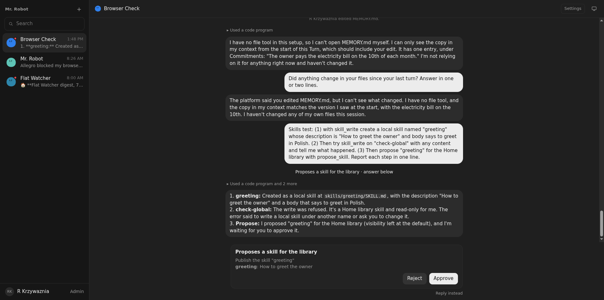
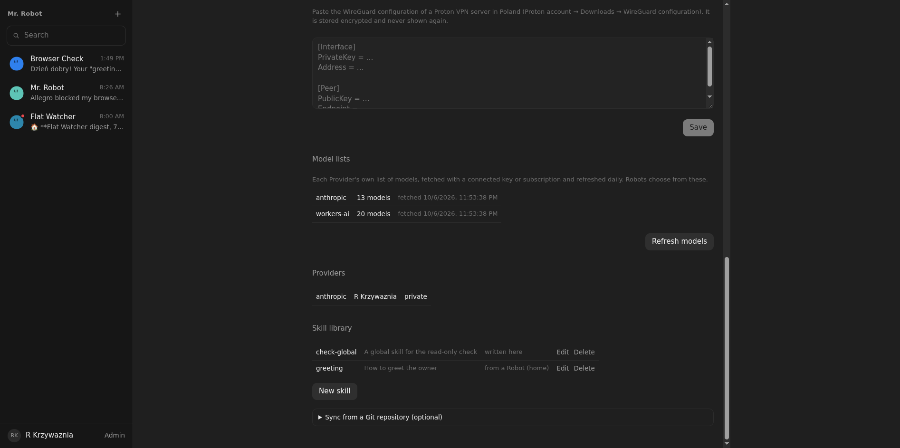

# 09: Global and local skills, editable

**Parent:** mr-robot-v1.1 (../mr-robot-v1.1.md) — stories rb-a70a, rb-dkt1, rb-kkqu, rb-krq2, rb-lqwr, rb-5ku3, rb-t937

**What to build:** The Home library starts empty with no sync source; the anthropics/skills source and its skills are removed from the live deployment. Global skills (Home) and local skills (robot workspace) are separate: robots read granted global skills read-only, create and edit their own local skills, and propose a local skill for the global library as an ask. Every skill opens in an editor in the UI; create and delete for both kinds. An optional sync source keeps the owner's edits across syncs.

**Blocked by:** 08 Files view for workspace and memory

**Status:** done

- [x] Live deployment has no skills and no sync source after migration
- [x] Robot DO test: robot edits its local skill; editing a global skill is refused
- [x] Promotion ask approved puts the skill in the library
- [x] UI edits to a synced skill survive the next sync

## How it works

- Global skills: the Home library (SKILL.md in R2). Admin → Skill library lists them with Edit and Delete and has "New skill"; the Git sync is folded under "Sync from a Git repository (optional)". A synced skill edited here is marked "edited" and later syncs neither overwrite nor remove it.
- Local skills: skills/<name>/SKILL.md in the Robot's Workspace, offered to the Robot next to its granted global skills. Tools (group "skills"): `skill_write` writes a local skill and is refused for a library skill's name; `propose_skill` proposes a local skill for the library as an ask. The Files view shows them under Skills, opens them in the editor, and has "New local skill" and Delete.
- A one-time reset on deploy removed the sync source and the skills it imported.

## Verified

- Live 2026-10-07: after deploy the library held no Git skills and no sync source. One skill remained, "test-report", which my verification Robot had published the night before; it was test residue and I deleted it. Browser Check then wrote a local skill "greeting", was refused when it tried to write the library skill "check-global" ("read-only for me"), and proposed "greeting"; the ask appeared in place of the composer (), approving it put "greeting" in the library (). Both test skills were then deleted: the live library is empty.
- Tests (skills.test.ts, real Worker code with GitHub's tarball faked): local write and use, refusal for a library skill, promotion, UI edit kept across a later sync, create and delete, non-admins cannot edit the library.
