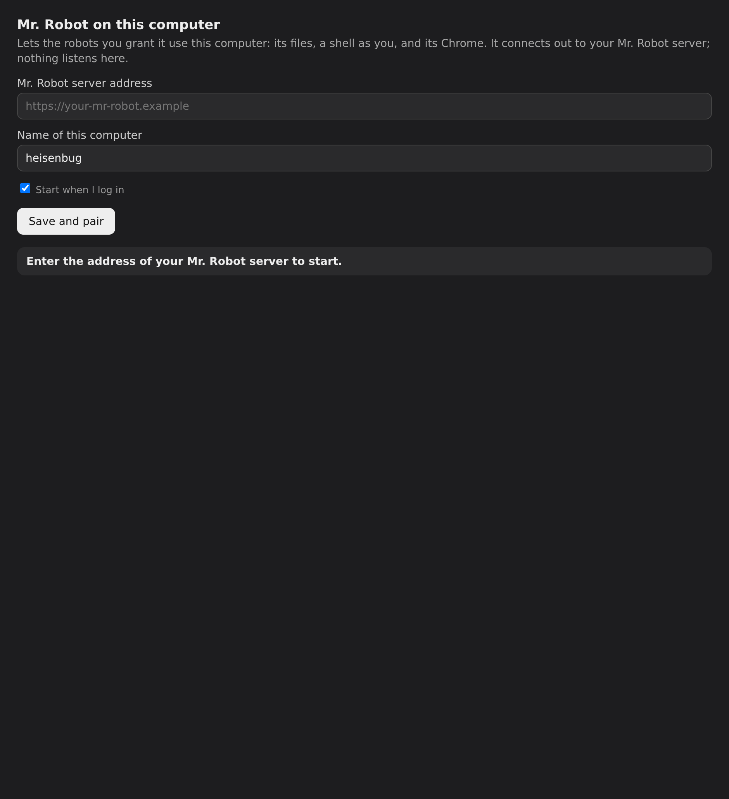
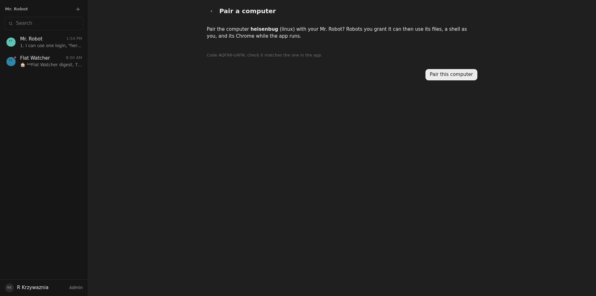

# 01: Host app, pairing, registry, channel

**Parent:** mr-robot-v1.2 (../mr-robot-v1.2.md) — stories hs-vtg3, hs-hend, hs-5slg, hs-ebba, hs-ro43, hs-qwlq, hs-0eka, hs-rwxw, hs-xax9, hs-ntbd, hs-7dlt, hs-w8vi, hs-0cr2

**What to build:** The Mr. Robot desktop app (Electron, Linux and macOS, run from source in this ticket) signs the Member in with Cloudflare Access, takes a host name, and connects outbound over one WebSocket to the edge; the Member DO registers the host (online, last seen, platform), shows it in the profile, allows sharing with the Home and unpairing. Effect RPC schemas shared by app and Worker; per-robot per-host grants (browser, files, shell) exist and are enforced at the Member DO; Mr. Robot is exempt. The app requires the server address at first start (no built-in default) and can change it and re-pair; while connected it heartbeats version, platform and capabilities (graphical session, Chrome found), the Member DO marks the host offline when heartbeats stop, and the admin view lists every host of the Home with owner, sharing, online/offline, last seen, version and the robots using it. A tray icon shows status; the app starts at login.

**Blocked by:** None (can start immediately)

**Status:** in-progress

- [x] Pairing from the app shows the host online in the profile within seconds; closing the app shows it offline
- [ ] Host shared with the Home is visible to the other Member; private is not
- [x] Unpair from the profile disconnects the app and revokes its token
- [x] Robot DO test with a fake host: a call without the matching grant is refused at the Member DO
- [ ] Tray status and autostart verified on Linux and macOS
- [ ] First start without a server address cannot proceed; changing the address re-pairs
- [x] Admin view lists the host with last seen and capabilities; stopping heartbeats marks it offline

## How it works

- **apps/host** (Electron, run from source here): asks for the server address at first start (no default), the computer's name, and "Start when I log in".
  - **Pairing:** the app gets a code from `POST /api/host/pair/start` and opens `<server>/#/pair/<code>` in the browser, where the signed-in Member taps "Pair this computer". The app then picks up its host token once from `/api/host/pair/poll` and stores it in ~/.config/mr-robot-host/host.json (mode 600).
  - **Connection:** one outbound WebSocket to `/api/host/connect`, with a heartbeat every 15 s (version, platform, hostname, graphical session, Chrome path) and reconnects with growing pauses.
  - **Tray and autostart:** a tray icon with status, and an XDG autostart entry on Linux or a login item on macOS.
- **Access:** `/api/host/*` sits outside the Access login (a second Access application with a bypass policy, infra/stack.ts HostChannel). The Worker checks the host token (stored as a SHA-256 hash) instead.
- **Typed RPC:** packages/host-protocol has the Effect RPC group (Read, Write, Run, BrowserOpen, BrowserClose, HostError) and the socket transport, shared by the app and the Worker.
- **Member DO** (member/hosts.ts): registers hosts, accepts their sockets (hibernatable), marks a host offline 45 s after its last heartbeat (alarm) or when its socket closes. It checks the grant ("<host>:browser|files|shell") of the calling Robot before any call reaches the host; Mr. Robot is exempt. A host shared with the Home serves every member's robots.
- **Home:** keeps the host index for sharing, the profile list and the admin list (owner, sharing, online, last seen, version, capabilities, robots using it).
- **Web:** Profile → Hosts (online/offline, sharing, Unpair), Admin → Hosts, Advanced settings → Hosts (per-host browser/files/shell grants), and the pairing page.

## Verified

- **Robot DO tests** (test/hosts.test.ts) with a fake app speaking the real protocol over a real WebSocket:
  - pairing, heartbeat, sharing visible to the other member and private not, the admin list;
  - unpair closes the socket (4001) and the old token gets 401;
  - a robot without the grant is refused at the Member DO and its command never reaches the host;
  - Mr. Robot is exempt; offline host gives a clear error; stopped heartbeats mark the host offline.
- **First start, live on the owner's NixOS machine (heisenbug)**, 2026-10-07 15:50: without a server address, "Save and pair" answers "That is not a server address." and nothing proceeds ().
- **Pairing:** with the live address, approving in the browser () showed the host online 2.7 s later in Profile → Hosts, with version 0.1.0, linux, graphical session and Chrome found. The admin view lists it. Closing the app showed it offline about 1 s later; starting it again brought it back online.
- **Unpair from the profile:** the running app was disconnected and dropped its host ID and token at once. Re-pairing through the app window worked and it reconnected by itself.

## Not yet verified

- Sharing with a second member live: the Home has no second member yet (only in the DO test).
- Changing the server address in the app and re-pairing (the code path clears the token when the address changes; not run live).
- Tray status and autostart on macOS (needs a Mac). On Linux the autostart entry is written; the tray icon was not checked on the desktop.
