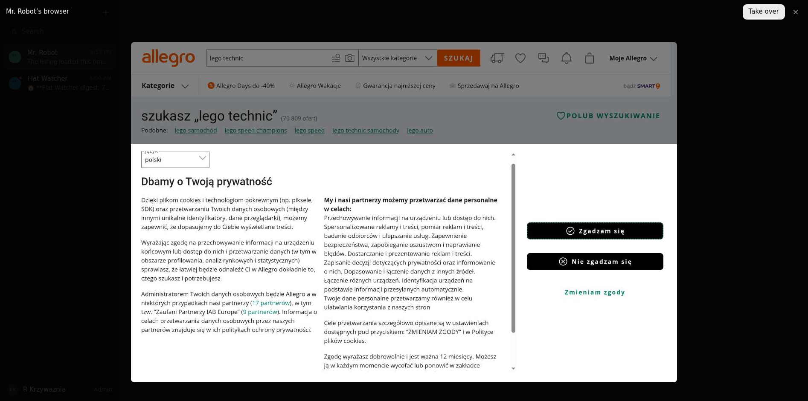
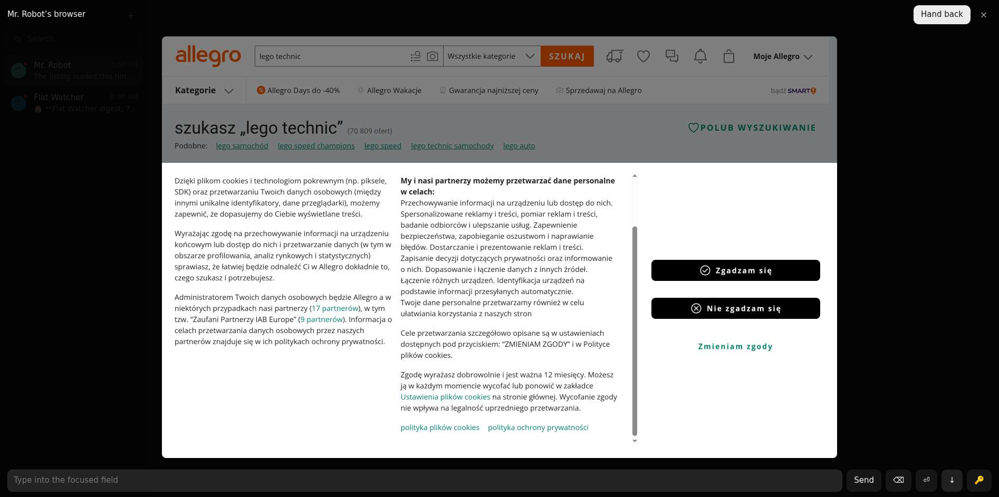

# 03: Host browser behind the browser seam

**Parent:** mr-robot-v1.2 (../mr-robot-v1.2.md) — stories hs-mqwd, hs-3wqx, hs-zmbc, hs-43aj, hs-1fp6, hs-nwcl, hs-8teq, hs-fnpy

**What to build:** The app launches the installed Chrome with a dedicated profile and a visible window and exposes CDP over the channel; the Robot DO offers it as backend 'Host browser: <name>' with the same tools, cookies kept in the host profile, block detection, usage (host minutes), live view and takeover relayed through the app. A robot on an offline host reports and notifies instead of using a cloud browser. The Allegro run (search, open offer, add to cart, stop before payment) is executed on the owner's host and recorded here.

**Blocked by:** 01 Host app, pairing, registry, channel

**Status:** in-progress

- [ ] Robot on 'Host browser: <owner's PC>' opens, observes, acts, screenshots
- [ ] Live view and takeover from the PWA work on the host browser
- [ ] Allegro run recorded with result
- [ ] Host offline: robot reports, owner notified, no cloud fallback unless configured
- [ ] Usage shows host browser minutes

## How it works

"Host browser: <name>" is a backend behind the same browser seam (backends.ts, host-driver.ts).
- **Opening:** the Robot asks the host owner's Member DO to open a session. The app starts the installed Chrome with its own profile (~/.config/mr-robot-host/chrome-profile), a visible window, DevTools on 127.0.0.1 only, and `--disable-blink-features=AutomationControlled`. It then connects that Chrome's DevTools to a relay socket on the Member DO; the Robot gets the other end.
- **Tools:** the tools, live view and takeover are the cloud ones. Closing closes the tab; Chrome and its cookies stay. Host browser time costs nothing.
- **Offline host:** an offline host is an error the robot reports, never a cloud fallback.

## Allegro on the owner's machine (heisenbug, home connection), 2026-10-07

| Run | Result |
|---|---|
| 15:51, Chrome started with DevTools only | challenged: "Confirm you are a human" slider (navigator.webdriver was true) |
| 15:53, same session, retry | refused by the robot: it remembered the block from the earlier Turn (a v1.1 bug, fixed: blocks are remembered for one Turn) |
| 15:57, with --disable-blink-features=AutomationControlled (webdriver false) | **pass**: "szukasz „lego technic” (70 809 ofert)", no block |

Live view and takeover through the app: the listing shown in Mr. Robot's takeover window (); after "Take over" the scroll control moved the consent panel in the host's Chrome (); "Hand back" returned it.

Remaining: the macOS host browser (needs a Mac), and the owner's own confirmation on his machine.
