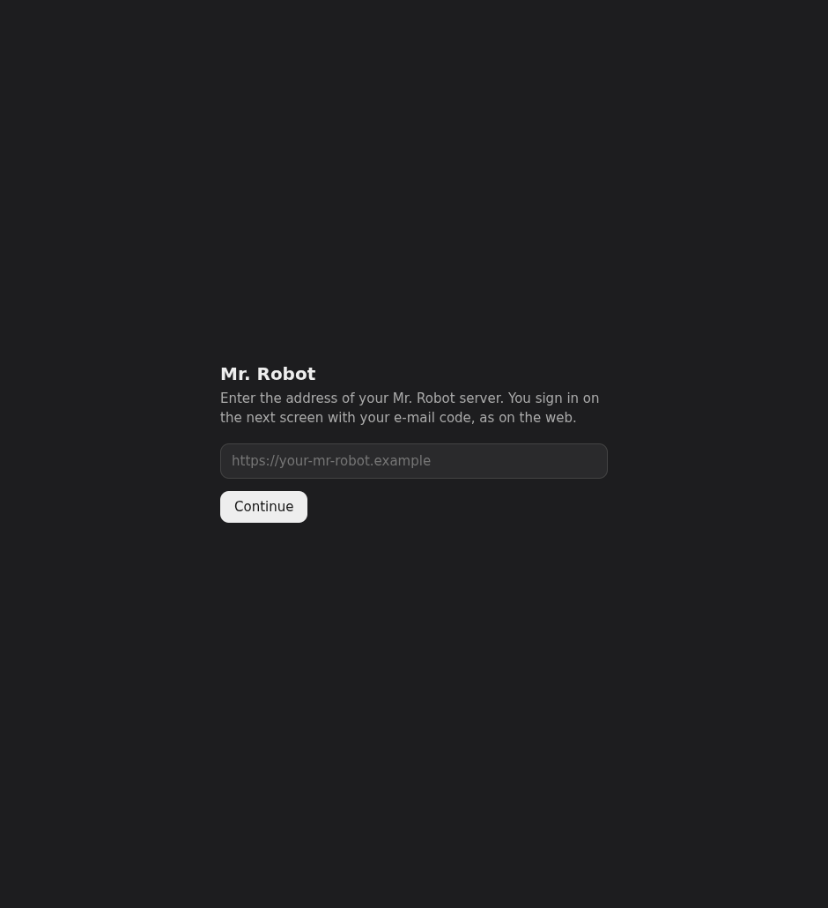
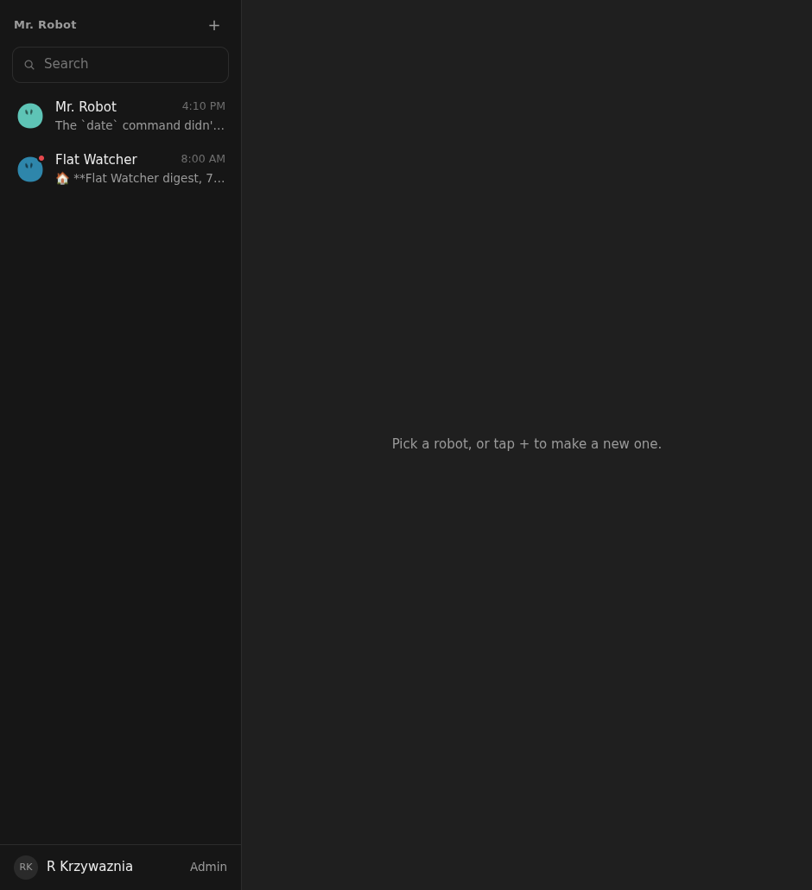
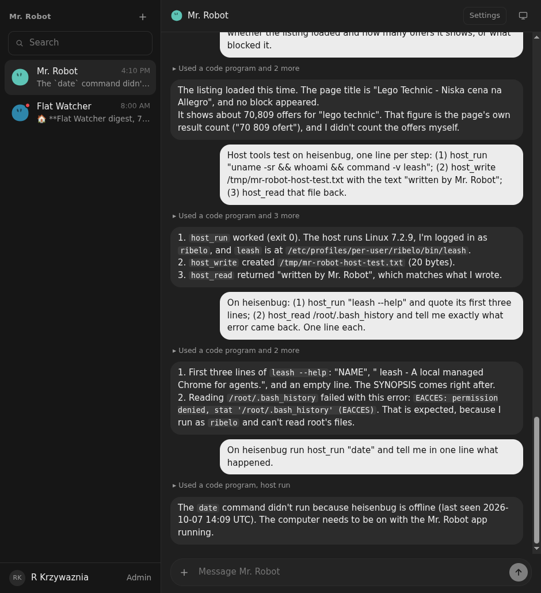
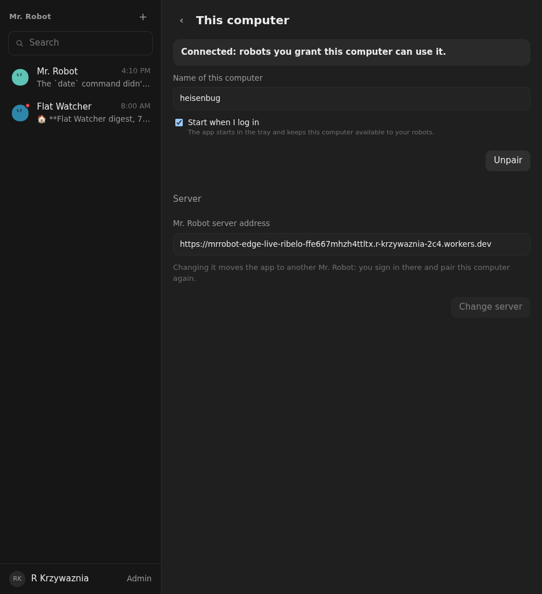

# 08: The desktop app shows the Mr. Robot interface

**Parent:** mr-robot-v1.2 (../mr-robot-v1.2.md) — stories hs-pyn0, hs-p0jr, hs-upeq

**What to build:** The desktop app's window is Mr. Robot: it loads the web interface from the configured server address with the same Access session as the browser, so robot list, conversations, panel, settings and admin are identical to the web. Pairing (server address, computer name, autostart, status, unpair) becomes one page inside that interface, "This computer", reachable from the profile and the tray, replacing the bare pairing form. Sign-in happens once (Access in the app window); the host token is minted from that session. Tray and autostart stay.

**Blocked by:** 01 Host app, pairing, registry, channel

**Status:** done

- [x] Opening the app shows the robot list and a conversation exactly as the web does
- [x] "This computer" page shows server address, name, autostart, status, unpair; pairing from it works
- [x] One sign-in: no second login for the host; the host appears under the signed-in Member
- [x] First start without a server address shows only the address prompt, then the interface
- [x] Verified on the owner's NixOS machine

## How it works

- **Window:** the app window loads the web interface from the server address, so it is the same Mr. Robot as in the browser. Cloudflare Access signs you in inside the window and the session persists in the app's profile.
- **First start:** only an address prompt. After it, the app loads the server.
- **Bridge:** a preload bridge (window.mrRobotHost) is available only to pages of the configured server, and the main process checks the calling page. It reads and changes the host settings.
- **"This computer" page:** reached from Profile → Hosts and from the tray ("This computer…"). It shows status, name, start at login, Pair/Unpair and the server address (changing it moves the app and asks for a new pairing).
- **One sign-in pairing:** the app starts the existing code pairing and the signed-in page approves the code itself. The host token goes to the app process only, never to the page.
- **Browser:** the page tells a browser user to install the app.
- **Tray and autostart:** unchanged.

## Verified on the owner's NixOS machine (heisenbug), 2026-10-07 17:55–18:05, packaged build (nix build .#host)

- **First start:** with no settings it showed only the address prompt (). After the address, the Access sign-in appeared in the window. The owner signed in once, and the app showed the robot list () and Mr. Robot's conversation, as on the web ().
- **Pairing:** Profile → Hosts → "This computer…" opened the page. "Pair this computer" connected with no further sign-in, and the computer appears under R Krzywaznia (). The earlier pairing was removed.
- **Not checked:** the tray's "This computer…" item itself (a desktop tray click).
