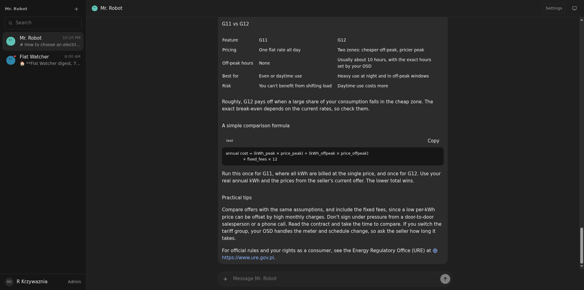
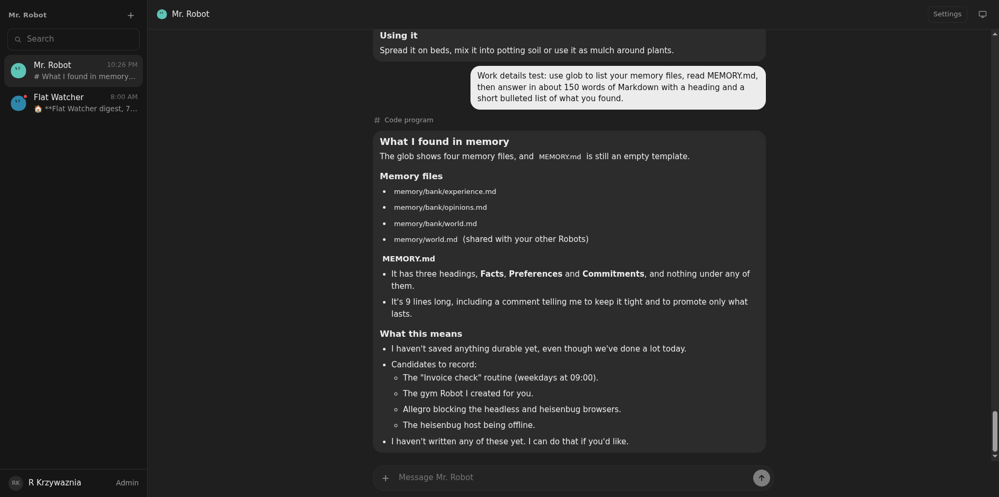

# 03: Markdown, streaming and Work details levels

**Parent:** mr-robot-v1.3 (../mr-robot-v1.3.md) — stories pl-6bop, pl-jzr7, pl-6eir, pl-s0hp, pl-etps, pl-0a2o

**What to build:** Robot messages render as Markdown; text and thinking stream in; a per-user Work details setting (Compact default, Standard, Detailed, Verbose) controls tool rendering, with Detailed and Verbose reusing the DSH conversation tool cards (ported, restyled). Trajectory unchanged.

**Blocked by:** None (can start immediately)

**Status:** done

- [x] Live: a long reply appears incrementally, thinking streams when the model exposes it
- [x] Markdown tables, code and links render
- [x] Compact shows one activity line; Detailed shows DSH-style cards with the same icons and expand behaviour
- [x] Setting persists per Member

## How it works

- **Markdown:** Robot replies render with DSH's MarkdownText (dsh-client-ui-primitives, the component the DSH conversation uses), so tables, code blocks with Copy, lists and links all render. Links open outside the app.
- **Streaming:** the composition listens to DSH's agent/assistant-stream. The Robot DO pushes the attempt's text and thinking so far over the live socket, about eight times a second, flushing pending text at the end. The page shows a live bubble until the stored message arrives. The stored log is unchanged.
- **Work details** (Profile → Work details, stored per Member, Compact by default):
  - Compact keeps the one activity line.
  - Standard shows each tool call as a collapsed DSH DisclosureRow card with DSH icons. The title is the tool and its main argument; it opens to show input, result or error, and the inner calls of a code program.
  - Detailed adds the model's thinking as a Think row.
  - Verbose opens everything.
  - The conversation API returns these details only with ?details=1.
- **Thinking from Claude:** the Anthropic adapter now asks for summarized thinking text (display: summarized), which newer models otherwise omit.
- The trajectory is unchanged.

## Verified

- Tests:
  - Stream frames carry the text and thinking and then a done frame.
  - Details (arguments, results, thinking) only with ?details=1.
  - Work details persists per Member.
  - Component test: Compact one line, Detailed cards and Think row, a Markdown table and link, the live bubble.
- **Live 2026-10-07, Mr. Robot on Claude Sonnet:**
  - Listening on the live socket, a 150-word reply arrived as growing frames: 18, 60, 115 … 858 characters over about 3 s.
  - In the page, the live bubble grew 19 → 80 → 225 → 442 → 588 characters at 250 ms polls.
  - A reply with a heading, a table, a code block and a link rendered as Markdown ().
  - At Detailed, a code-mode turn showed its "Code program" card above the Markdown answer ().
  - Claude Sonnet did no thinking on the test prompts even at low effort (84 output tokens in total), so live thinking was not observed. The thinking path is covered by the stub test.
  - The owner's Work details and Mr. Robot's effort were set back to Compact and off.
