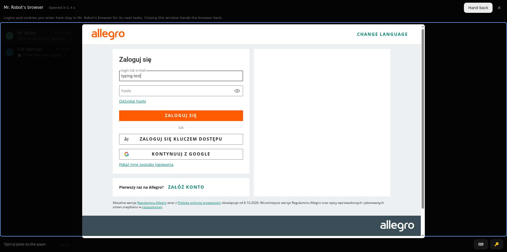
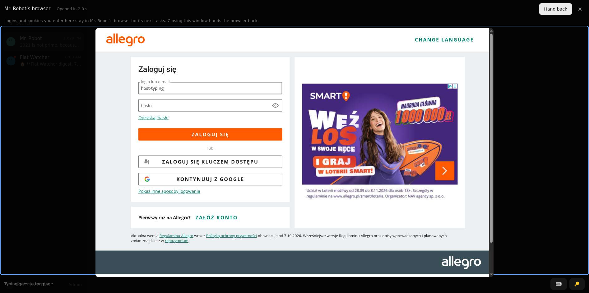

# 04: Takeover: keys, close semantics, cookie note, speed

**Parent:** mr-robot-v1.3 (../mr-robot-v1.3.md) — stories pl-485j, pl-vwq6, pl-glfh, pl-ju1l, pl-5agt, pl-n2vs

**What to build:** Keystrokes are captured while the takeover has focus and sent to the page; a phone keyboard button exists; closing the window hands back; the window states that cookies and logins persist; stage timings are recorded and the dominant cause of slow opening fixed, with two seconds on a warm backend as the target.

**Blocked by:** None (can start immediately)

**Status:** done

- [x] Typing in the takeover types into the page on the host browser and on Container Chrome
- [x] Closing the window resumes the robot's task or closes an idle browser
- [x] Timings per stage logged; before/after numbers in this ticket
- [x] Warm open under two seconds measured live

## How it works

- **Keys:** after "Take over" the screen takes focus (blue outline, "Typing goes to the page"). Printable keys go as text; Enter, Backspace, Tab, arrows, Delete, Home, End, Page keys and Ctrl/Meta shortcuts go as CDP key events with modifiers. The mouse wheel scrolls. The ⌨ button focuses a hidden field, which opens a phone's keyboard and forwards every key. The old side text field is gone.
- **Close = hand back:** the × button (and closing the tab) hands the browser back like "Hand back": the Robot resumes its task, or an idle browser is closed. The chat's own socket no longer keeps the claim. After hibernation the closing socket is excluded by state, not identity.
- **Cookie note:** "Logins and cookies you enter here stay in <Robot>'s browser for its next tasks. Closing this window hands the browser back."
- **Speed:**
  - Each open records stage timings (attach, backend with sub-stages, page, screencast, first frame). They are logged, sent to the window ("Opened in 1.4 s") and stage statuses are shown while waiting.
  - The dominant cause was restoring 63 cookies with puppeteer's setCookie, one relay round trip each (3.6 s). They now go in one Network.setCookies call (0.22 s).
  - Container Chrome is reused while running: closing closes tabs only, and the container sleeps after 3 idle minutes.
  - With a viewer watching, page navigation no longer blocks the first frame.

## Live measurements (Mr. Robot, Container Chrome via VPN unless noted), 2026-10-07

| | Time to first frame in the window |
|---|---|
| Before, any open (container booted every time) | 11.5 s, 12.4 s (backend 9.9 / 11.8 s) |
| Container kept warm, cookies still one by one | 5.2 s (cookies 3.6 s of it) |
| After, warm | **1.9 s, 1.8 s** (server first frame 1.53 / 1.40 s; cookies 0.22 s) |
| Cold container after the change | 9.8 s (container boot and VPN, not changed) |
| Host browser on heisenbug | 2.5 s, 2.7 s |

- **Typing:** real key presses (leash press) typed "typing-test" into Allegro's login field on Container Chrome () and "host-typing" on heisenbug's Chrome (). Both were cleared with Backspace; nothing was submitted.
- **Close:** after the fix, closing the window with × turned the takeover off and Mr. Robot went back to sleeping (panel: takeover null, state sleeping). Mr. Robot's browser setting was restored to the Home default.
- **Not met:** a cold Container Chrome start is still about 10 s; the 2 s target is met for warm opens only, as the ticket states.
