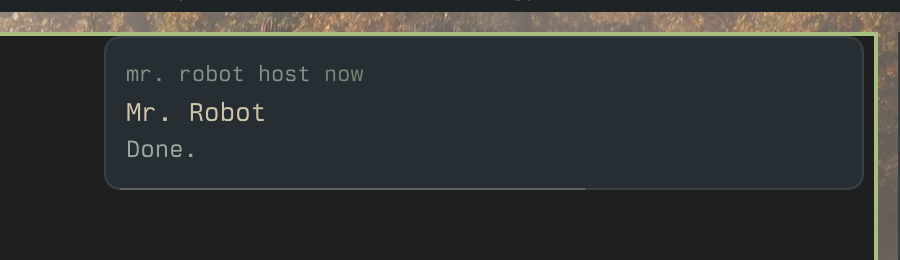

# 05: Native notifications in the app and unread badges

**Parent:** mr-robot-v1.3 (../mr-robot-v1.3.md) — stories pl-b5vp, pl-mhyg, pl-p4eg

**What to build:** The desktop app shows native notifications delivered over the host channel and never attempts Web Push; robots carry unread state per Member with badges in the list and on the tray; opening a conversation marks it read.

**Blocked by:** None (can start immediately)

**Status:** done

- [x] A robot's 'Done.' shows as a native notification on heisenbug
- [x] No 'registration failed' in the app
- [x] Badge appears on an unread robot and on the tray; opening clears it

## How it works

- **Host channel:** a new frame on the host channel, `{"t":"notify","d":{title, body, url, tag}}`. The Member DO sends it to every online computer of the Member at the moment it delivers Web Push, so quiet hours hold both. The app shows it with Electron's Notification; a click opens that conversation.
- **No Web Push in the app:** the app's bridge says nativeNotifications. Profile → Notifications then explains that the app shows system notifications, instead of offering the Web Push switch that failed there.
- **Badge:** the page reports how many robots in the list are unread to the app on every list refresh; a notification adds one meanwhile. The tray shows "N unread" in its tooltip and menu, sets the badge count (and a title beside the icon on macOS). Unread per Member and the list dots already existed (opening a conversation marks it seen).

## Verified on heisenbug (Nix build of the app), 2026-10-07

- **Test** (hosts.test.ts): a Robot's notify_owner "Done." arrives at the paired fake host as a notify frame with the conversation's URL.
- **Live notification:** Mr. Robot called notify_owner "Done." ("Sent."). On the session bus the app called org.freedesktop.Notifications.Notify ("Mr. Robot host", "Mr. Robot", "Done."), and the popup appeared on the desktop (). The tray tooltip then read "Mr. Robot · 2 unread · heisenbug · online".
- **Badge:** marking Mr. Robot unread put the dot in the list and "1 unread" in the tray tooltip; opening the conversation cleared both.
- The first version only re-sent the count when it changed, so a notification's increment stuck; it now re-sends on every refresh.
- **Note:** while another window has a conversation open (here the owner's own Chrome tab), new replies are marked seen at once, so they never become unread.
- The tray title is a macOS feature. On this desktop the count shows in the tooltip and menu; no visible number appears on the Linux tray icon.
