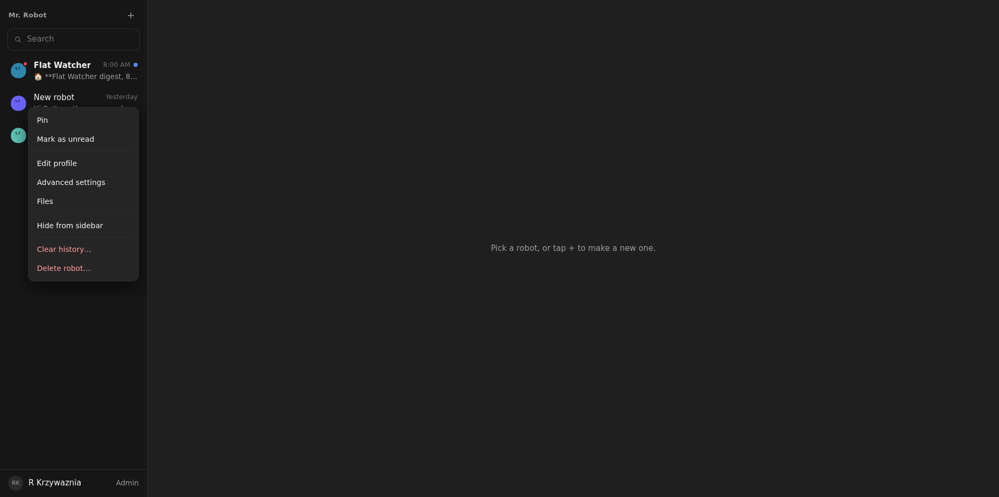
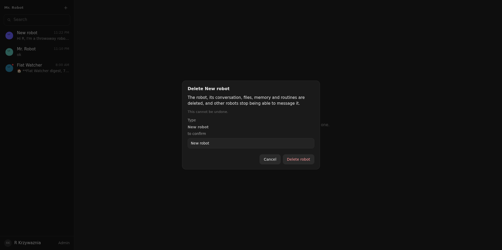

# 06: Delete robot, clear history, reset everything

**Parent:** mr-robot-v1.3 (../mr-robot-v1.3.md) — stories pl-3uoy, pl-05eu, pl-y228, pl-062x, pl-kehf

**What to build:** Delete a robot (not Mr. Robot) from its menu, clear any robot's history with optional memory, clear Mr. Robot, and reset everything from settings keeping logins, providers, hosts, members and global skills; every action needs the name typed and has no undo.

**Blocked by:** None (can start immediately)

**Status:** done

- [x] Robot DO test: delete removes DO state, R2 prefix, routines, grants references
- [x] Clear history keeps config, routines, memory unless chosen
- [x] Reset leaves exactly the kept categories; a fresh sign-in shows Mr. Robot only
- [x] Mr. Robot cannot be deleted; typed-name confirmation everywhere

## How it works

- **Delete** (robot menu → Delete robot…, or Advanced settings → Delete…):
  - The Robot DO closes its composition, browser and sockets, deletes its R2 Workspace prefix, its alarm and all its storage. Its tables are prepared again, so the same id can be created anew.
  - The Home removes its registry row and drops it from every other Robot's recipient grants.
  - Mr. Robot is refused.
- **Clear history** (menu or Advanced settings, any Robot including Mr. Robot):
  - A new live session; the old session log, notices, rewinds, queued wake-ups, outbox and memory baseline are deleted.
  - Configuration, grants, routines and files stay.
  - "Also clear its memory" resets MEMORY.md and the memory bank to templates and deletes the daily notes.
- **Reset everything** (Profile, per person):
  - Every Robot of the person is deleted, Mr. Robot included, then a fresh Mr. Robot is created.
  - USER.md, PROACTIVE_PREFERENCES.md and memory/world.md go back to templates; usage, list preferences and waiting notifications are deleted.
  - Logins, provider credentials, push devices, computers, members, HOME.md and the skill library stay.
- **Confirmation:** a dialog states what goes, what stays and that there is no undo. The button stays disabled until the exact name is typed (the Robot's name; the person's name for a reset). The server checks the name again and answers 400 otherwise.

## Verified

- **Robot DO tests** (deletion.test.ts):
  - Delete: refused with a wrongly cased name and for Mr. Robot; afterwards the robot is gone from the list, its R2 prefix is empty, its DO has no config, and Mr. Robot's recipients no longer list it.
  - Clear: the conversation is empty, the name and config are kept, and MEMORY.md is kept; the next request does not carry the old message. With memory, MEMORY.md is back to the template. Mr. Robot can be cleared.
  - Reset: only a fresh Mr. Robot is left, USER.md is reset, the login "shop" is still there, and the new conversation is empty.
- Two earlier lifecycle tests asserted the old soft delete (archive kept); they now assert deletion for good.
- **Live 2026-10-08, a throwaway robot:**
  - The menu shows Clear history… and Delete robot… in red for the owner's robots ().
  - Clear history took the conversation from 1 message to 0.
  - Delete: the button stayed disabled until "New robot" was typed (). After confirming, the list showed only Flat Watcher and Mr. Robot, the robot's panel answered 404, and Mr. Robot's recipients held only Flat Watcher.
  - Reset everything and clearing Mr. Robot were not run live, because they would delete the owner's real robots and history; the tests cover them.
