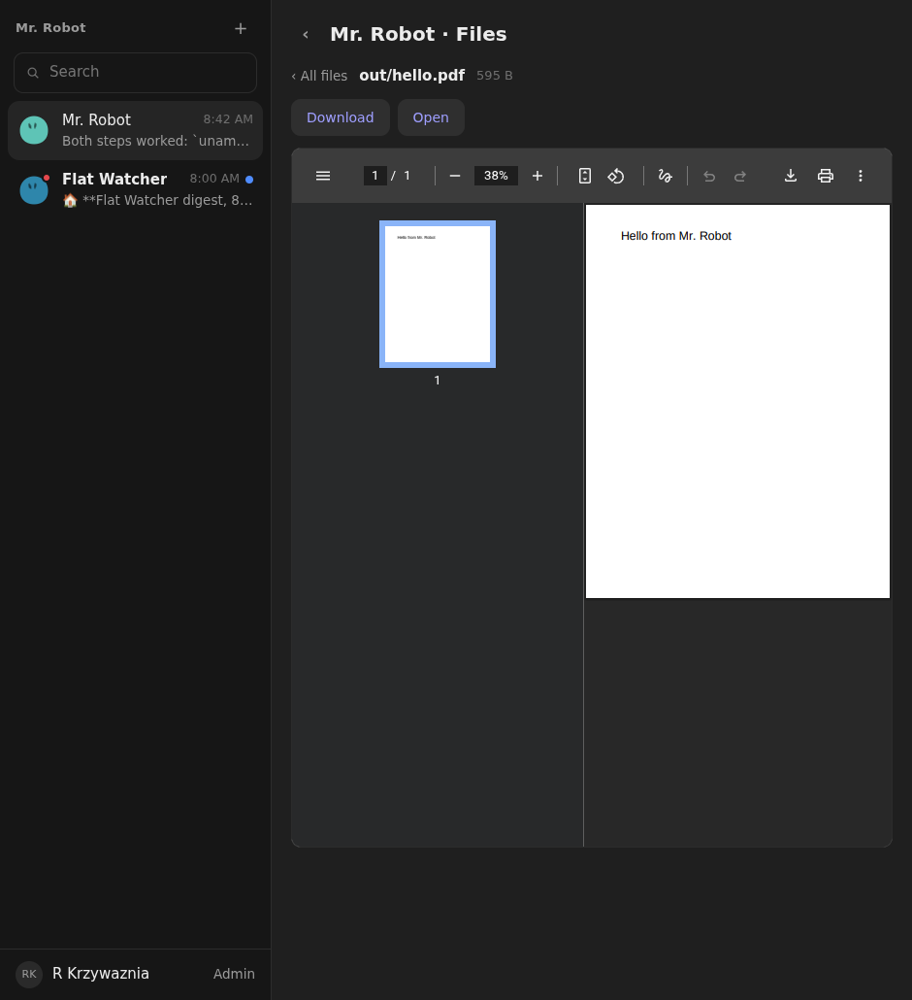
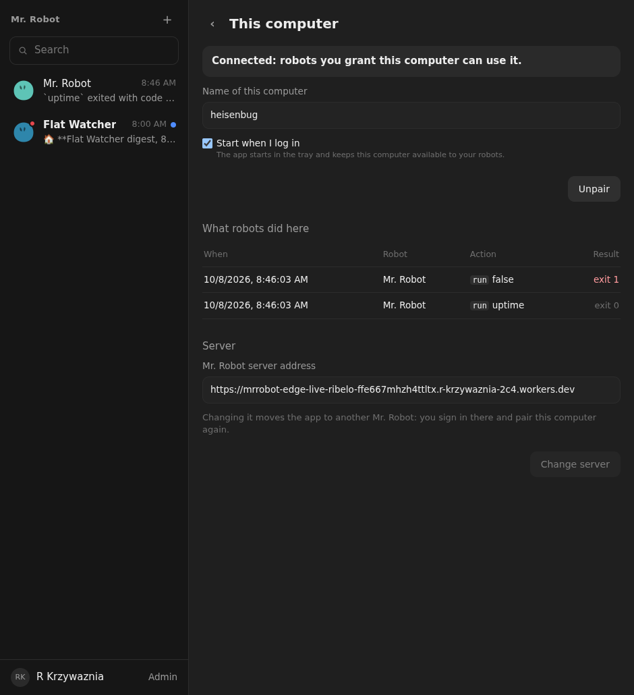
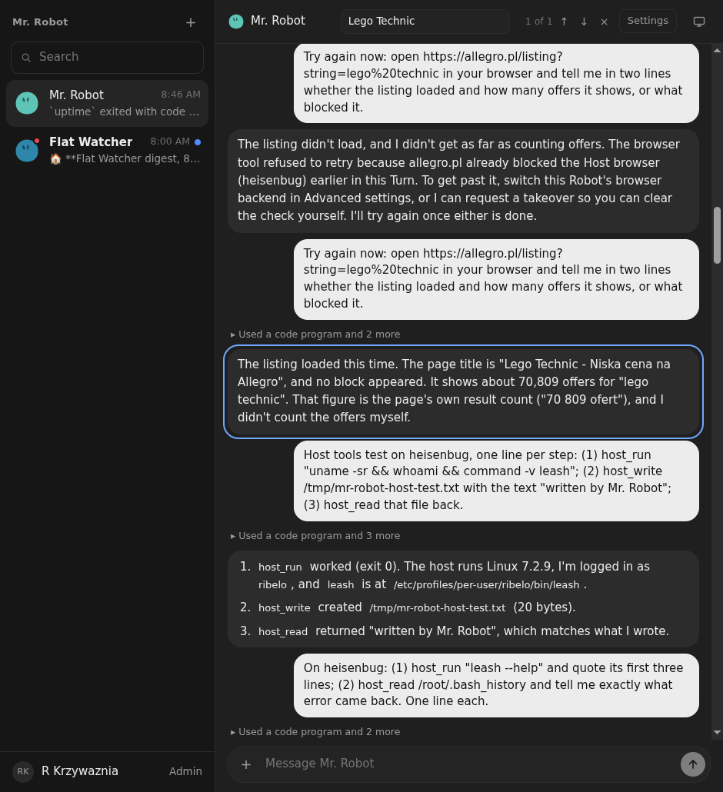

# 07: Search, file preview and download, host action log

**Parent:** mr-robot-v1.3 (../mr-robot-v1.3.md) — stories pl-8594, pl-4nfk, pl-ojbr, pl-vcy7

**What to build:** Search within a conversation and filter the robot list; preview (text, images, PDF) and download attachments and workspace files; a log of host actions (robot, command, time, exit status) on This computer.

**Blocked by:** None (can start immediately)

**Status:** done

- [x] Search finds a phrase in an older page of the conversation
- [x] Robot list filter by name
- [x] Preview and download work for a PDF the robot wrote
- [x] host_run entries appear on This computer with exit status

## How it works

- **Search in a conversation:** a magnifier in the conversation header opens a field. Matching runs over every item of the conversation (messages with attachment names, replies, notices, thinking, routines, asks), newest first. Enter and the arrows move between matches, which are scrolled into view and outlined; "N of M" shows the position. The chat loads the whole conversation, so older parts are searched too.
- **Robot list filter:** the sidebar's Search field filters robots by name (it existed; now covered by a test).
- **Preview and download:** a new route `/api/robots/:id/raw?path=…[&download=1]` serves a Workspace file with its content type, inline or as an attachment.
  - Images and PDFs show inside the file view (the PDF in the browser's viewer); every file has Download, and previewable ones also have Open.
  - Chat attachments are links: the name opens it, ↓ downloads it.
  - Files that are neither PDF nor image get a sandboxing content policy and nosniff, so a robot-written HTML or SVG cannot run on the app's origin.
- **Host action log:** every host call through the Member DO is recorded: robot, read/write/run, path or command, time, outcome or error, exit code. It keeps the last 500 per computer. `GET /api/hosts/:id/actions` is for the owner only, and This computer shows it under "What robots did here", with failures in red.

## Verified

- **Tests:**
  - Worker: host_run through a fake host is logged as Mr. Robot-style entries (robot name, `run`, the command, done, exit 0), and another Member gets 404.
  - Worker: the raw route serves a PDF inline and as an attachment with application/pdf; a Markdown file gets the sandbox policy.
  - Web: the search match is marked; attachment links for preview and download; the list filter by name.
- **Live in the desktop app on heisenbug, 2026-10-08:**
  - Mr. Robot wrote out/hello.pdf (a hand-written one-page PDF). The file view showed it in the PDF viewer with Download and Open (); the raw route answered 200 application/pdf.
  - Mr. Robot ran `uptime` and `false` on heisenbug. This computer listed both with time, robot and exit 0 / exit 1 (). A run made in the first seconds after the deploy was not logged, because the Member DO still served the previous version.
  - Searching "Lego Technic" in Mr. Robot's conversation jumped to the previous day's Allegro answer and outlined it, "1 of 1" ().
  - Saving through Download in the app's own save dialog was not clicked through; the download headers are covered by the test.
