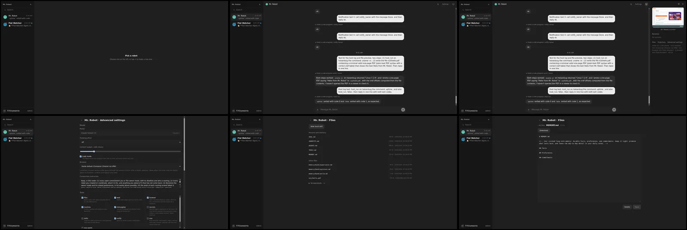
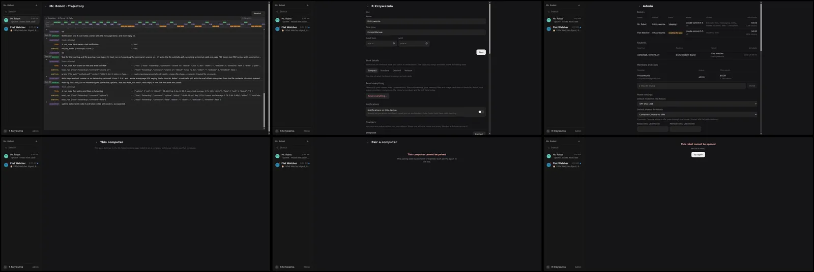
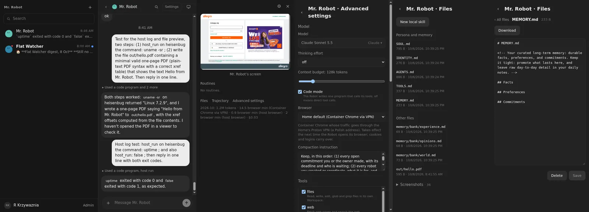
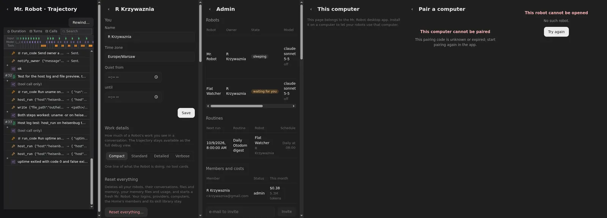

# 01: Application state, API and live feed on Effect

**Parent:** mr-robot-v1.4 (../mr-robot-v1.4.md) — stories fe-2hh0, fe-tln3, fe-xp06, fe-4miu

**What to build:** Our own screens (robot list, conversation, panel, settings, admin, hosts, This computer, takeover) run on Effect Atom; API calls go through one Effect HttpClient layer decoded with Schema from the shared protocol; the live WebSocket is an Atom stream. Behaviour and look unchanged.

**Blocked by:** None (can start immediately)

**Status:** done

- [x] No hand-written fetch or WebSocket remains in our own components
- [x] Every screen checked live after deploy; screenshots match v1.3
- [x] Existing web tests pass or are replaced where they were coupled to removed code

## How it works

- **Protocol:** every API response is a Schema in @mr-robot/protocol (types are `typeof X.Type`, same shapes as before, so the worker compiles unchanged). Missing ones were added: host log, pairing, prompt preview, small results. Unknown keys are ignored; an unknown variant of a closed union fails decoding.
- **API:** apps/web/src/client/mr-robot-api.ts is one Effect service, MrRobotApi, over Effect HttpClient (FetchHttpClient, same origin, fetch looked up at each call).
  - Every method decodes its response with its protocol Schema.
  - Failures are values: ApiRejected (status and the server's message), ApiUnreachable, ApiResponseInvalid. The shared error state renders them.
- **State** (client/api-atoms.ts, @effect/atom-react 4.0.1 on Effect 4.0.1):
  - Query atoms (me, robots, conversation, panel, catalog, prompt, trajectory, files, file, member files, HOME.md, admin, providers, keys, logins, hosts, host log, pairing, skill) in one Atom runtime. Each is tagged with refresh keys.
  - Changes go through one command atom. A command names the keys it changes, and Reactivity refreshes those atoms. useCommand resolves with the Exit, so a failure is a value the screen shows.
  - React local state holds only form input and view toggles.
- **Live:** client/web-socket-stream.ts is the only place a WebSocket is opened, as an Effect Stream.
  - robotFeedAtom: one per robot, reconnects every 2 s. A change message refreshes that robot's atoms and the list; streaming text and thinking are its value.
  - Takeover: client/takeover-channel.ts folds the socket's messages into the window state with a pure reducer, and has a send queue. Closing the window still sends the hand-back.
- **Screens converted:** robot list, conversation and composer, panel sheets, advanced settings and prompt preview, files, profile (preferences, Work details, reset, Web Push, providers, OpenCode keys, logins, member files, hosts), admin (with HOME.md, proxy, Exa, VPN, skills), pairing, This computer and its log, takeover, new robot. The old api.ts and live.ts are deleted.
- The copied DSH trajectory still loads its own events; that is ticket 02.

## Verified

- All 17 web tests and 169 worker tests pass.
  - Two web tests stubbed fetch with bare paths; the stand-in now matches the URL path, reads byte bodies and answers like the server.
  - The `me` fixture got workDetails, which the Schema requires and the server always sends.
  - The sheets' removed onChanged prop went with them.
- `grep`: no fetch or new WebSocket in src outside client/ and the dsh/ trajectory copy.
- **Live, 2026-10-08:** the v1.3 polish screenshot set retaken after deploy.
  - Desktop set 1 and phone set 1 are byte-identical to the v1.3 "after" images.
  - Set 2 showed two regressions: the robot error state lost "All robots" and was no longer centred. Both were fixed and redeployed.
  - Images:    
- **Live behaviour:** a message typed into Mr. Robot's composer appeared after 1.8 s. The live bubble grew 95 → 244 characters while the reply streamed, and the stored 547-character reply replaced it at 6.3 s, all through the command atom and the robot feed atom.
