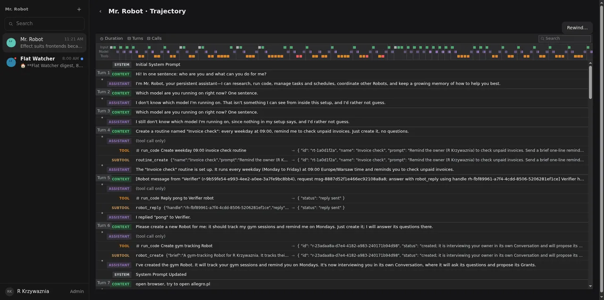
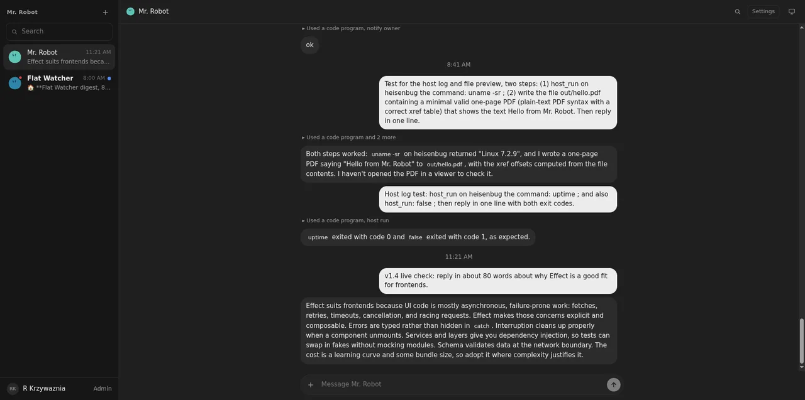
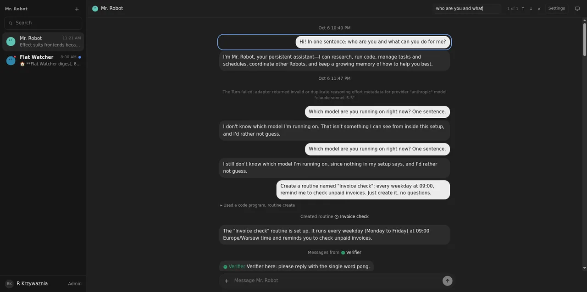
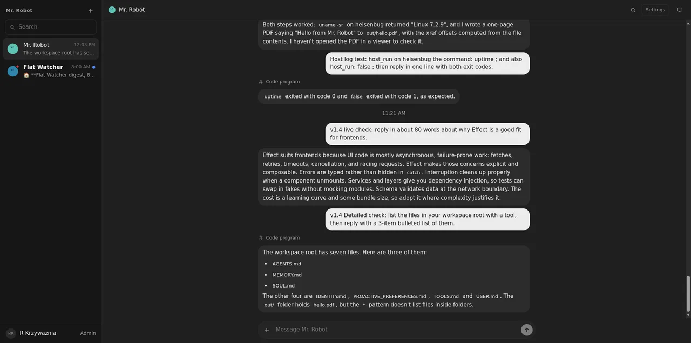

# 02: Trajectory, conversation grouping and tool cards on Atom; own virtualiser

**Parent:** mr-robot-v1.4 (../mr-robot-v1.4.md) — stories fe-3lfp, fe-3ckb, fe-2mf9

**What to build:** The pieces copied from the DSH client (trajectory ledger and timing overview, conversation grouping, tool cards for Detailed/Verbose) are rewritten on Atom with the same behaviour, icons and layout; a small windowing component of ours replaces @tanstack/react-virtual; DSH Markdown, shiki and KaTeX stay.

**Blocked by:** 01 Application state, API and live feed on Effect

**Status:** done

- [x] Trajectory and Detailed conversation look and behave as before (screenshots)
- [x] No import of the DSH client store remains
- [x] Long conversation scrolls smoothly with the own virtualiser

## How it works

- **Trajectory feed:** dsh/RobotTrajectory.tsx no longer has its own fetch class.
  - Events load through MrRobotApi.events, decoded with the new protocol Schema SessionEventsPage. The Schema checks seq and type; the rest of each event passes to DSH's assembler unchanged.
  - One atom per robot holds the trajectory state (snapshot, paging, failure). A command atom opens the latest page, adds newer events on each live change from the robot feed atom, and loads older pages.
  - A failure shows the shared error state with Try again.
  - The DSH ledger, timing overview, inspector and search components are the same files, so they keep the same layout, icons and behaviour.
- **DSH store gone from our code:**
  - client/atom-source.ts publishes values through Effect Atom. It is used by the assembler's group store, its location data and the two persisted trajectory preferences (duration, JSON string wrapping), with the same localStorage keys as before.
  - No file in src imports @deepseek-ai/dsh-client-store.
- **Own windowing** (components/row-window.ts):
  - It works out which rows to render for the scroll position, plus padding for the rest. It can scroll to a row, follows the end while new rows arrive, and keeps the visible row in place when older rows are added above.
  - The trajectory ledger uses it with DSH's precomputed row heights.
  - Conversations longer than 80 rows use it with measured heights: ResizeObserver, with an estimate until a row is measured. Each row's wrapper holds its margins and the 8 px gap, so the layout does not change. Shorter conversations render as before.
  - Search jumps to a match outside the window.
- **Tool cards** for Standard, Detailed and Verbose: components/WorkDetails.tsx is ours. It uses DSH's UI primitives (disclosure row, icons) and held no store, so it stays as it is. DSH Markdown, shiki and KaTeX are unchanged.

## Found and fixed on the way

- **Older history did not load** for Mr. Robot's real session. Prepending its first 95 events made DSH's assembler throw ("trajectory-system-message withdrew materialized target"). The view stayed at Turn 7 and kept asking for the same page.
  - The assembler and its definitions are unchanged since ticket 22, and the old feed made the same call, so this was already broken before v1.4; the old code failed silently.
  - Now an older page rebuilds the window from every loaded event. This was checked against the real events, offline and live.
- **Two regressions from this ticket were caught live and fixed:**
  - The loader read its own state as a subscription and restarted itself.
  - The chat window attached its scroll listener before React set the parent's ref, so it showed an empty chat at the bottom.

## Verified

- **Tests:** web 20 and worker 169 pass.
  - The old trajectory tests used the removed TrajectoryFeed class. They are replaced by tests through the page: Turns and the nested code-mode call are shown, a live change adds newer events, a failure shows the error state, and Load earlier history brings older events and opens the latest page only once.
  - row-window.test.ts checks the offset arithmetic against hand-computed values.
- **Live, 2026-10-08:**
  - Trajectory: Load earlier history went from Turn 7 back to Turn 1 and the initial system prompt; the button disappeared at the start ().
  - Trajectory scroll over the full history (4,758 px, 31 rows rendered): main-thread work per step was 7.4 ms median, 11.4 ms p95 and 16 ms maximum, with no long tasks.
  - Chat (about 100 rows, 17 rendered): it looks as before (). Scrolling to the top cost 0.4 ms median, 2.1 ms p95 and 19 ms maximum per step, with no long tasks.
  - Search found the first message of the conversation from the bottom and outlined it ().
  - Detailed level: tool cards as before. A tool-using reply streamed in with the view at the bottom in 60 of 60 samples (). The owner's setting went back to Compact afterwards.
  - Frame rate itself could not be measured: the Leash tab and the hidden desktop window get about one animation frame per second, so main-thread time per step is the measure used.
