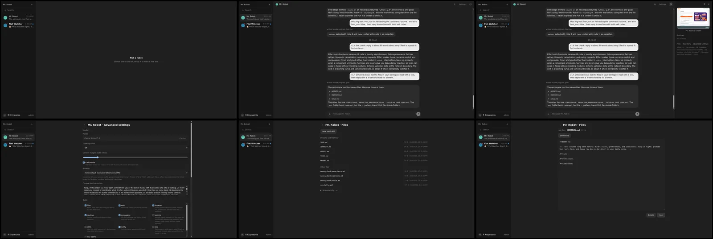
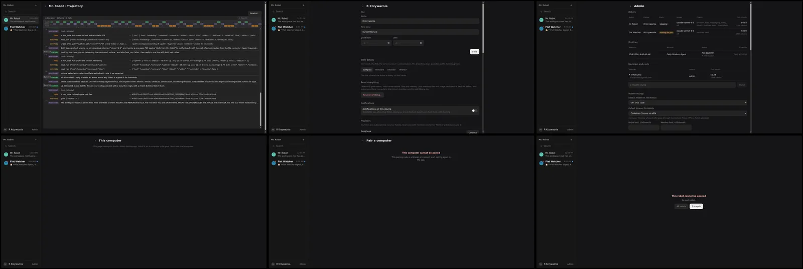
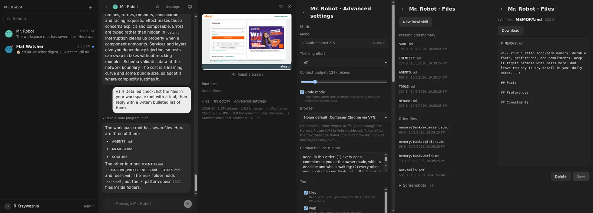
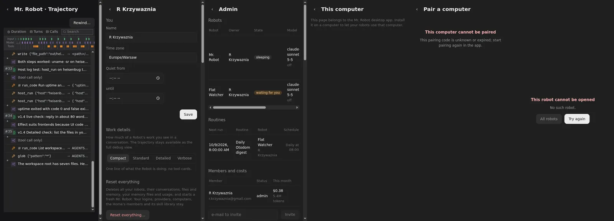

# 03: Remove zustand, immer, TanStack; guard the tree

**Parent:** mr-robot-v1.4 (../mr-robot-v1.4.md) — stories fe-mza0, fe-iqay

**What to build:** zustand, immer and every @tanstack package are gone from package.json and the lockfile; the dependency lint fails if any returns.

**Blocked by:** 02 Trajectory, conversation grouping and tool cards on Atom; own virtualiser

**Status:** done

- [x] pnpm why zustand / immer / @tanstack/* returns nothing for the web app
- [x] Dependency lint has the rule and passes
- [x] Build and all suites green; deployed

## What changed

- **Removed from apps/web/package.json and the lockfile:** zustand, immer, @tanstack/react-virtual (and with it @tanstack/virtual-core), and @deepseek-ai/dsh-client-store.
- **The DSH store import:** DSH's UI primitives (Markdown, disclosure rows, icons, which stay) import `createSnapshotStore` from the DSH client store. They use it only in a settings-form model Mr. Robot never renders.
  - The DSH packages declare no runtime dependencies (the host app provides them), so Vite and Vitest now resolve that package name to src/client/dsh-store-on-atom.ts, a few lines on the Atom source.
  - Nothing reaches zustand or immer, and no shipped asset contains them.
- **Dependency lint:** scripts/dependency-lint.ts (`pnpm lint:deps`, part of `pnpm check`) has a third rule. It walks the web app's full installed tree (`pnpm list --depth Infinity`) and the lockfile, and fails on zustand, immer or any @tanstack/* package, naming the path that brought it in.

## Verified

- `pnpm --filter ./apps/web why zustand`, `why immer` and `why '@tanstack/*'` each print nothing. pnpm-lock.yaml has no match, and the built assets have none.
- **Lint proof:**
  - With zustand added back, `pnpm lint:deps` failed (exit 1): "Forbidden web dependency: zustand (via @mr-robot/web)" plus its lockfile entries.
  - With @tanstack/react-virtual added back, it also named @tanstack/virtual-core (via @tanstack/react-virtual).
  - After removing them it passes: "web tree free of zustand, immer and @tanstack".
- **`pnpm check`** (lint, typecheck, all suites): 191 tests pass. In one earlier run, one worker takeover test ("reattaches the waiting browser after the Robot restarts") failed on timing. It passed alone three times and in the next full run; no worker code changed in this ticket.
- **Deployed, 2026-10-08.** Final live screenshot set compared with the v1.3 polish ticket: every page has the same layout; only newer conversation content differs.
  -    
  - This pass found that the windowed chat stopped short of the end on a phone: rows measured taller than the estimate after the first scroll. The window now keeps following the end until the person scrolls away. Live, it opens at 0 px from the end on phone and desktop.
