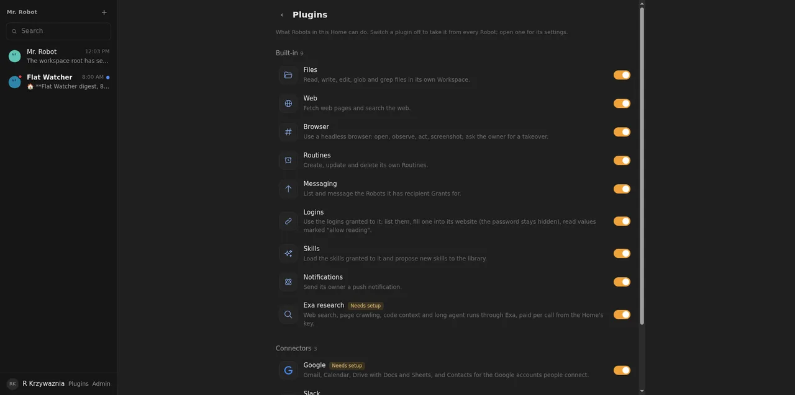
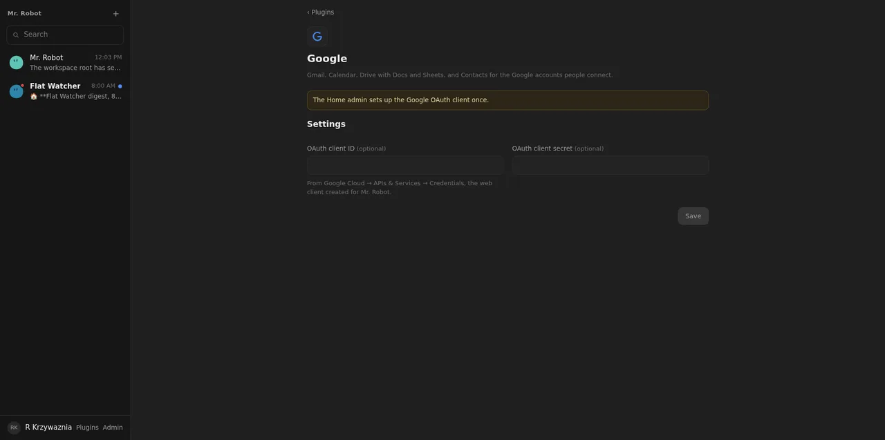
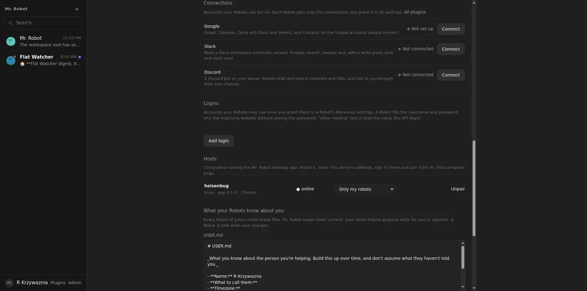

# 01: Connector core, Plugins page, per-plugin settings rows

**Parent:** mr-robot-v1.5 (../mr-robot-v1.5.md) — stories cn-dbm9, cn-s1pd, cn-a1i0, cn-qs78, cn-xezx, cn-bsge, cn-f6ux

**What to build:** Connections per Member (private or Home-shared), granted per robot, secrets in the vault as credential references, configuration per plugin derived from its schema; a Plugins page with on/off per Home and a settings page with one row per plugin (status, Connect/Manage) as in the DSH references; tools take an account parameter when several connections exist; every connector call recorded in the trajectory with secrets masked.

**Blocked by:** None (can start immediately)

**Status:** done

- [x] Plugins page and settings rows render from plugin schemas; adding a plugin adds its row without UI code
- [x] Each plugin opens a detail page (icon, name, description, schema-derived form, Save) as in docs/reference/13
- [x] Robot DO test: an ungranted connection is invisible to the robot; a Home-shared one is usable by another Member's robot once granted
- [x] Secret fields never appear in configuration, logs or trajectory
- [x] Account parameter routing verified with two fake connections

## How it works

- **Plugin catalog** (apps/worker/src/plugins/catalog.ts): every plugin with title, description, icon, its tool groups, an optional Home settings schema (Schemastery), and for connectors how a person connects (OAuth with a service choice, or pasted values described by a schema).
  - Built-in: Files, Web, Browser, Routines, Messaging, Logins, Skills, Notifications, Exa research (its key is now set on its plugin page; the Admin Exa field writes the same secret).
  - Connectors: Google, Slack, Discord (their tools come in tickets 02–06).
- **Forms from schemas** (connectors/schema-form.ts): the server describes each schema field as text, secret, number, yes/no or a choice; the web app renders only that description, with no per-plugin code. Fields with role "secret" are sealed apart in the vault; the configuration and every response say only whether one is stored. An empty secret field keeps the stored one.
- **On/off per Home:** a plugin switched off is taken out of every Robot's composition and out of the grant catalog.
- **Connections** (member/connections.ts): kept by their owner's Member DO.
  - The row records kind, label, account, services, status and default. Secrets are sealed per field in the Member's vault, and the row only references them.
  - A shared connection is published to the Home's index. The Home lists a Member's own and shared connections, and resolves one for a Robot only if it belongs to the Robot's owner or is shared.
- **Grants:** `grants.connections` holds "<id>" to read and "<id>:write" to send or post. Mr. Robot reaches all his owner's connections, as with logins.
- **Connector core** (connectors/connector.ts): a connector plugin builds its tools through `connectorTool`.
  - A tool takes `account` when more than one connection is eligible; otherwise it uses the only one or the default.
  - Secrets are resolved from the vault at each call, the grant is checked again, and the secrets are masked from everything the Turn writes.
  - Every result starts with "[kind · Label (account)] action", which is what the trajectory shows.
  - Refused credentials set the connection to "needs consent again" (Google) or "paste again".
  - HTTP goes through Effect HttpClient: responses are decoded with Schema, 429s are retried after Retry-After (twice), and failures are tagged values.
  - Write tools exist only when a connection has the write grant.
- **Web:**
  - Plugins page (#/plugins, sidebar link): Built-in and Connectors groups, a switch per plugin (admin), "Needs setup" badges.
  - Plugin page (#/plugins/<name>): icon, name, description, the form from the schema, Save.
  - Profile → Connections: one row per connector with status and Connect/Manage. Manage lists the connections with Default, "Shared with the Home" and Remove, plus the paste form (from the schema) or the OAuth service choice.
  - A Robot's Advanced settings: a grant per connection, plus the separate write grant.

## Verified

- **Worker test connectors.test.ts** (Robot DO through the API; fake connector with recorded HTTP):
  - The plugin list and a form derived for the admin only; a secret saved but never returned; an empty secret field keeps the stored one; the switch (403 for a non-admin) removes the browser tools and its catalog entry.
  - An ungranted connection gives no tools; a granted one acts as its account, and its token is not in the trajectory.
  - Two connections: account "Work" routes to Work, no account goes to the default, the default moves when changed, and the write tool acts only on the account with the write grant.
  - A connection Ben shares with the Home works for Anna's Robot once granted; Anna cannot change it; it disappears when Ben unshares.
  - A 401 sets "needs-reconsent" with the service's note.
- **Web test plugins.test.tsx:** a plugin the web app has never seen ("Notion" in the fixture) gets its list row and switch, its detail form (a stored secret is not sent back unless typed), its connection row and its paste form, without code for it.
- **Totals:** worker 175 tests, web 23 tests.
- **Live, 2026-10-08:** the Plugins page (), the Google page with its settings form () and the Connections rows () on the deployed app. For a short time after each deploy, /api/connections answered 500 because the Member DO was still on the previous code. It answered normally a little later; no change needed.
