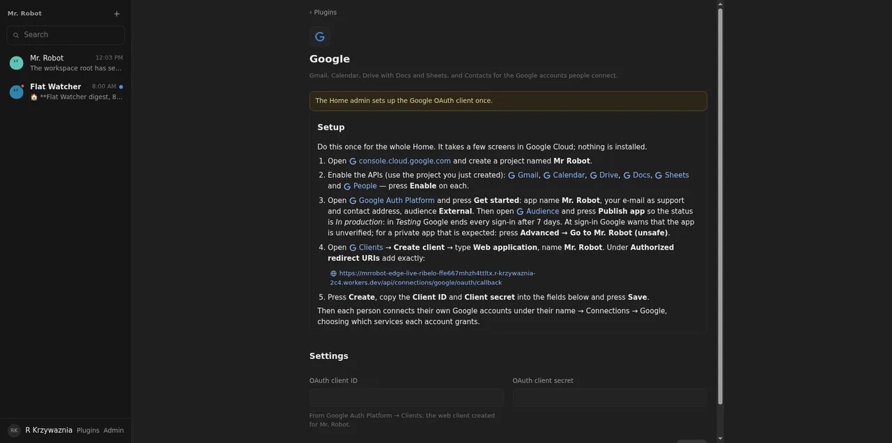

# 02: Google: guided OAuth client setup and Connect Google

**Parent:** mr-robot-v1.5 (../mr-robot-v1.5.md) — stories cn-fpyt, cn-aq2a, cn-lzqh, cn-j1la, cn-9s7r

**What to build:** A guided admin page for the one-time Google Cloud OAuth client (steps, callback URL, paste client id and secret); 'Connect Google' per Member with service choice at consent; refresh tokens in the vault, refreshed without the owner; re-consent surfaced with a one-click fix.

**Blocked by:** 01 Connector core, Plugins page, per-plugin settings rows

**Status:** done

- [ ] Live: the owner completes the client setup and connects one account from the page
- [ ] Second account connects with different services
- [ ] Refresh works after token expiry without the owner
- [ ] Revoked token shows 'needs re-consent' and reconnect fixes it

## How it works

- **Admin page (Plugins → Google):** a step-by-step guide in Markdown, checked against Google's current Auth Platform help.
  - Steps: create the project, enable the six APIs (direct links), Get started, publish to *In production*, create a Web client with **this** deployment's callback URL, paste the ID and secret.
  - *In production* matters: in *Testing*, Google ends every sign-in after 7 days.
  - The client secret is sealed in the Home's vault; the form says only "Stored".
- **Connect Google:** `/api/connections/google/oauth/start?services=…` asks Google only for the scopes of the chosen services, with offline access and prompt=consent, so a refresh token is always issued; a one-time state expires after 15 minutes.
  - The callback exchanges the code, reads the account's address, and stores what Google actually granted. If the person unticks Drive on Google's screen, the connection lists only Gmail and Calendar.
  - Connecting the same address again updates that connection instead of adding a second.
- **Refresh without the owner:** each use checks the token's expiry (with a two-minute margin) and refreshes through the Member DO, one refresh at a time per connection.
- **Re-consent:** a refused refresh ("invalid_grant") or a 401 sets **Needs consent again** with Google's note. **Reconnect** starts the consent again for that account (login_hint) and repairs the same connection.

## Verified

- **google-connect.test.ts** (Robot/Member DOs through the API, Google answers recorded):
  - With no client set, Connect returns to the page with "has not set up the Google OAuth client", and the guide carries this deployment's callback URL.
  - The consent URL carries exactly the chosen scopes, offline and consent; the exchange sends code, client and redirect URI; the state works once.
  - A second account keeps its own services.
  - An expired token is refreshed for a Robot's call, and the service sees the new token.
  - A revoked refresh shows "needs-reconsent" and Reconnect repairs the same connection id.
- **Live (2026-10-08):** the Plugins → Google page with the guide and the real callback URL on the deployed app ().
- **Open, needs the owner:** the client setup in his Google Cloud, a first and a second account connected, a refresh after expiry, a revoke and reconnect. All four are in the batched questions.

## Live, 2026-10-08 (with the owner, through Leash)
- **Google Cloud project "Mr Robot" (mr-robot-511013):**
  - The six APIs are enabled, and the Auth Platform is set up: External, *In production*, home and privacy links on this deployment, authorized domain r-krzywaznia-2c4.workers.dev.
  - A Web client "Mr. Robot" has this deployment's callback URL. Its ID and secret are saved on Plugins → Google, and the page no longer says it needs setup.
  - Publishing needed the home and privacy links and the authorized domain on Branding. Without them, Google keeps **Publish app** disabled. The guide does not say this yet.
- **Connect Google** with Gmail, Calendar, Drive and Contacts: Google's unverified-app warning → Advanced → continue, per-scope consent → back on the profile page with "Connected r.krzywaznia@gmail.com". The connection lists gmail, calendar, drive, contacts.
- **Found live:** the Gmail read scope (gmail.modify) also allows sending at Google's level. Sending is held back by the robot's write grant, not by the consent.
- **Fixed live:** the Connect Google link button rendered blank (text colour the same as its background), and the account showed twice in the trajectory header when the label is the address.

## Live, 2026-10-08 (continued)
- **Refresh without the owner:** about an hour after connecting, after the first access token had expired, Mr. Robot read the Gmail labels (21 labels) and the connection stayed "connected". The token was refreshed by itself.
- **Re-consent:**
  - The owner's grant to Mr. Robot was removed in Google Account → Connected apps → Mr. Robot → "Usuń wszystko". Only the grant is removed; Google confirms no data is deleted.
  - The next read set the row to **Needs consent again**, with Google's message and **Reconnect**.
  - Reconnect (Google's warning → continue → consent) came back to "Connected r.krzywaznia@gmail.com" on the same connection (one row, same id, no note). A read then worked again.
