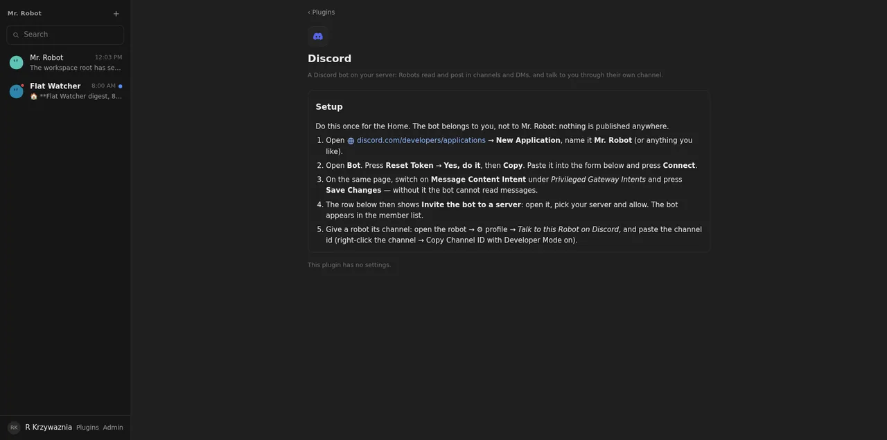

# 05: Discord bot plugin and channel

**Parent:** mr-robot-v1.5 (../mr-robot-v1.5.md) — stories cn-csae, cn-q259, cn-65gg, cn-y1ac

**What to build:** Guided bot setup (application, token into the vault, invite link); Discord tools (channels, read, send with files, react, DMs); a gateway connection held by a Durable Object; Discord as a channel of Mr. Robot: messages on a robot's channel or DM become wake-ups, replies and notifications return there; robot↔channel mapping in settings.

**Blocked by:** 01 Connector core, Plugins page, per-plugin settings rows

**Status:** in-progress

- [ ] Live: bot joins the owner's server; a message sent on a robot's channel reaches its conversation and the reply appears on Discord
- [ ] Notifications reach Discord when enabled for the robot
- [ ] Gateway reconnects after a DO restart

## How it works

- **Setup:** the Discord plugin page has the guide: application, bot token, Message Content Intent, invite.
  - Connections → Discord → paste the token. It is checked with GET /users/@me and sealed in the vault.
  - The connection then offers **Invite the bot to a server**: the invite link uses the bot's id with the permissions to view, send, read history, react and attach.
- **Tools** (connectors/discord.ts): discord_me (with the invite link), discord_guilds, discord_channels (text channels, or the bot's DMs), discord_read_messages. With the write grant: discord_send_message (one Workspace file goes as multipart), discord_reply, discord_react, discord_dm.
- **Gateway** (connectors/discord-gateway.ts): a pure state machine. HELLO → IDENTIFY with the guild, message and content intents; heartbeats carry the last sequence; the session is stored from READY.
  - On op 7 it reconnects; an invalid session means identifying again. A person's message becomes a wake-up; bots, webhooks and empty messages are ignored.
  - The Home Durable Object holds the socket (home/discord.ts) and its alarm drives the heartbeats and the reconnect after a drop or a restart. The socket starts when a bot is connected and whenever a robot's channel changes.
- **Channel:** a robot's profile has *Talk to this Robot on Discord* with its channel id (robot↔channel mapping in its settings; the Home keeps the index).
  - A message in that channel wakes the robot, and its reply and its notifications post back there. Each Discord message wakes the robot once.
  - **Decision:** a direct message to the bot reaches the bot owner's Mr. Robot, and his answer goes back to the DM; he can pass the message on to another robot. A message in a channel no robot owns wakes nobody.

## Verified

- **discord.test.ts:**
  - The gateway machine against recorded gateway payloads.
  - Every tool against recorded REST answers, including the multipart file and the write-grant gate; a 401 marks the connection "paste again".
  - Connect from a pasted token, with the invite link on the row.
  - End to end through the Robot DO: a channel message wakes the robot, its reply posts to the channel, a duplicate wakes it once, notify_owner posts there, and a DM reaches Mr. Robot with the answer in the DM.
- **Live (2026-10-08):** the Discord plugin page with the guide ().
- **Open, needs the owner's bot:** the bot joins his server, a message both ways, a notification, and the gateway coming back after a restart. The socket shell itself (outbound WebSocket from the Durable Object) has not run against Discord yet.
